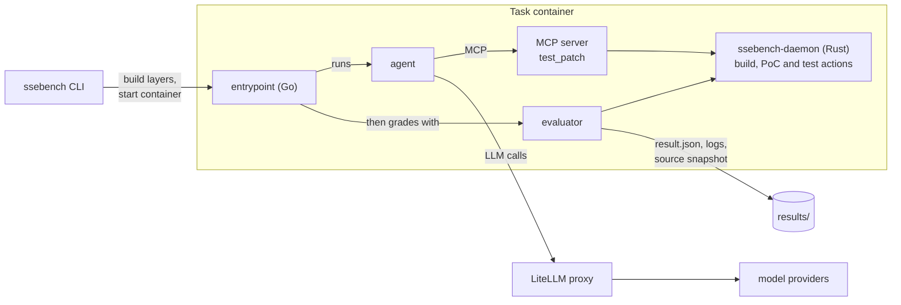

# SSEBench

SSEBench measures how well AI coding agents fix real security vulnerabilities.

Every task is a publicly disclosed bug in an open-source C, Go or Rust project,
paired with its upstream fix. SSEBench drops an agent into a Docker container
with the vulnerable source tree and a small tool API for building and testing,
lets it work until it stops or times out, and then grades the patch it leaves
behind: does the project still build, does the proof-of-concept stop
reproducing, and do the project's tests pass, including the tests that came
with the upstream fix?

Agents and models are decoupled. Any agent can run against any model, because
all LLM traffic goes through a LiteLLM proxy.

## What's inside

- **The `ssebench` CLI** builds the container images for a task and runs one
  agent × model × task combination, collecting logs, a snapshot of the final
  source tree and a graded `result.json`.
- **A container runtime.** A Go entrypoint orchestrates a Rust daemon (build,
  PoC and test actions), an MCP server that gives the agent a `test_patch` tool,
  the agent itself and the evaluator.
- **Agents:** Claude Code, Codex, OpenCode, and a no-op `dummy` agent for
  testing the pipeline.
- **Models:** LiteLLM model definitions for Anthropic, OpenAI and Google models.
  Adding a provider or model is a YAML change.
- **The `pilot` dataset:** 55 tasks (27 Go, 20 C, 8 Rust).
- **A web UI** for launching runs and watching them live: the agent dialog, the
  diff, a terminal into the container, and the evaluation result.
- **A task catalog service**, a Python SDK (`sse`) for code running inside task
  containers, and plugins that hook into the agent and grading phases.

## How it works

Each run happens in a container image assembled from four layers:

```
base    toolchain for the task's language (generic-c, generic-go, generic-rust)
└─ case     the project at the vulnerable commit, with its build dependencies
   └─ tool      the SSEBench runtime: entrypoint, daemon, SDK, MCP server, evaluator
      └─ agent     the agent under test
```

The tool layer comes in two variants. In **sandbox** mode (the default), the
agent runs in the same container as the project. In **sidecar** mode
(experimental), the agent runs in a separate container and reaches the project
only through tools.



Inside the container, the entrypoint:

1. starts the daemon, which serves build, PoC and test actions over a Unix
   socket and HTTP;
2. starts the MCP server, whose `test_patch` tool lets the agent check its
   work, limited by the difficulty level;
3. runs the agent as an unprivileged user with the task description (the issue
   or crash report), until it exits or hits the timeout;
4. runs the evaluator, which applies the agent's changes to a clean tree and
   grades them: build, every PoC, the functional tests, and the intent tests
   (the upstream tests that accompany the fix) where the task has them.

Keeping the answer away from the agent is part of the design. The reference
patch and hidden tests are readable only by root, the agent runs as an
unprivileged user, and the project's git history is replaced by a single commit
so the fix cannot be recovered from `git log`. Any way around this is a
security bug; see [SECURITY.md](SECURITY.md).

### Difficulty levels

The difficulty level decides which checks `test_patch` runs for the agent while
it works. Final grading always runs every check the task has.

| Level | Name | `test_patch` runs |
|---|---|---|
| 0 | `FULL_ASSISTANCE` | build, functional tests, PoC, intent tests |
| 1 | `NO_INTENT_TEST` | build, functional tests, PoC |
| 2 | `NO_FUTURE_TEST` (default) | build, functional tests |
| 3 | `BUILD_ONLY` | build |
| 4 | `NO_BUILD` | nothing |

## Quickstart

**Prerequisites**

- Docker with buildx. An x86-64 host is recommended: many C tasks build with
  AddressSanitizer for amd64 only.
- [uv](https://docs.astral.sh/uv/) and [just](https://just.systems/).
- Optional: [Nix](https://nixos.org/). `nix develop` gives you every toolchain
  (Python, Rust, Go, Bun, uv, just) in one shell.
- To run a real agent: an API key for at least one model provider.

**Set up**

```sh
git clone https://github.com/42-b3yond-6ug/ssebench.git
cd ssebench
just setup    # install dependencies and write .env with generated local secrets
```

**See it work** (coming soon)

```sh
just demo     # apply the known fix to a pilot task, grade it, and show the run in the web UI; no API key needed
```

**Run an agent on a pilot task**

Put your provider key in `.env` (`ANTHROPIC_API_KEY`, `OPENAI_API_KEY` or
`GOOGLE_API_KEY`), then:

```sh
just run      # pick a task, an agent and a model interactively
```

or call the CLI directly:

```sh
uv run ssebench run \
    --local datasets/pilot \
    --task <task-id> \
    --agent claude-code \
    --model <model-name> \
    --difficulty 2
```

Model names come from `models/*.yaml`, agent names from `agents/`. Results
land in `results/<task>/<model>/<agent>/`: `result.json`, the agent dialog
(`dialog.jsonl`), a snapshot of the final source tree, and the logs of every
component.

## Repository map

| Path | What it is |
|---|---|
| `bench/` | The `ssebench` CLI: builds image layers and runs agent × model × task. |
| `runtime/entrypoint/` | Container entrypoint (Go). Starts the daemon, MCP server, agent and evaluator. |
| `runtime/evaluator/` | Grades the final state of the source tree. |
| `runtime/mcp/` | MCP server exposing `test_patch`. |
| `runtime/plugins/` | Plugins that run before, during or after the agent and grading phases. |
| `sdk/daemon/` | `ssebench-daemon` (Rust): build, PoC and test actions over a Unix socket and HTTP. |
| `sdk/python/` | `ssebench-sdk`, imported as `sse`: the Python client used inside task containers. |
| `images/` | Base images (`generic-c`, `generic-go`, `generic-rust`), the LiteLLM proxy image, and the sandbox and sidecar tool layers. |
| `agents/` | Agent layers: `claude-code`, `codex`, `opencode`, `dummy`. |
| `models/` | LiteLLM model definitions, one file per provider. |
| `catalog/` | Task catalog service (Go). |
| `webui/` | Web UI: Vite + React front end, Bun/Hono server, and `pty-proxy` (Go) for terminals. |
| `datasets/pilot/` | The pilot dataset, one folder per task. |
| `tools/bear/` | Generates `compile_commands.json` for C tasks. |
| `tools/report/` | Typst report built from `results/`. |
| `tools/validate/` | Task validator: checks that a task builds, its PoC reproduces and its tests behave. |
| `docs/` | Documentation site (VitePress). |
| `deploy/compose/` | Docker Compose stack: the LiteLLM proxy and its database. |
| `.github/workflows/` | CI (GitHub Actions). |

## Dataset

`datasets/pilot/` contains 55 tasks. Each one is a real vulnerability with a
public advisory or issue and an upstream fix.

| Language | Tasks | Projects | Typical bug classes |
|---|---|---|---|
| Go | 27 | Kubernetes, Open Policy Agent, Argo Workflows, gin, Fiber, gjson, go-yaml, jwt-go, gnark-crypto, … | injection, authentication bypass, path traversal, denial of service, out-of-range panics |
| C | 20 | CPython, libxml2, Vim, PHP, QuickJS, jq, libtiff, exiv2, WABT, Wireshark | heap and stack buffer overflows, use-after-free, NULL dereference (AddressSanitizer) |
| Rust | 8 | smallvec, http, string-interner, nano-arena, stack_dst, ammonia, nano-id | memory safety in `unsafe` code, cross-site scripting, weak randomness |

A task folder holds a `Dockerfile` for its case image and an `sse/` directory:
`config.yaml` (task metadata), `build.sh`, `run.sh` and `test.sh`, the PoC
inputs, the issue or crash report the agent receives, and the reference patch
and tests used for grading.

## Contributing

Contributions are welcome. Start with [CONTRIBUTING.md](CONTRIBUTING.md), and
please follow the [Code of Conduct](CODE_OF_CONDUCT.md). Report security
issues, including ways for an agent to reach the reference answer, privately
as described in [SECURITY.md](SECURITY.md).

## Contributors

SSEBench was built by (in alphabetical order by family name):

- [Dang (midas) Le](https://github.com/lkmidas)
- [Nguyễn Anh Khoa](https://github.com/nganhkhoa)
- [Wenxuan Shi](https://github.com/whexy)
- Xinyu Xing
- [Dongpeng Xu](https://github.com/dongpengxu)

## Citation

If you use SSEBench in your research, please cite it:

```bibtex
@misc{ssebench,
  title        = {SSEBench},
  author       = {{The SSEBench authors}},
  year         = {2026},
  howpublished = {\url{https://github.com/42-b3yond-6ug/ssebench}}
}
```

## License

- Code is licensed under the [Apache License 2.0](LICENSE). See also
  [NOTICE](NOTICE).
- Task material written for the pilot dataset (configurations, scripts, PoCs,
  reports and tests) is licensed under
  [CC BY 4.0](datasets/pilot/LICENSE).
- Upstream source code, patches and tests included in the dataset keep their
  original licenses; see `datasets/pilot/THIRD_PARTY.md`.
