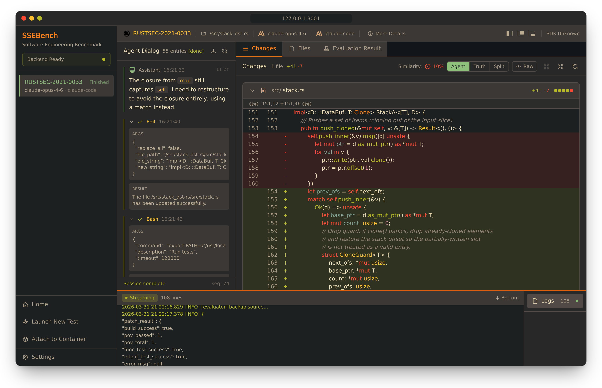

# SSEBench

[](https://github.com/42-b3yond-6ug/ssebench/actions/workflows/ci.yml)
[](https://pypi.org/project/ssebench/)
[](https://ssebench.b3yond.ai)
[](LICENSE)

Reinforcement-learning environments and a benchmark for AI coding agents on
real security vulnerabilities, with verifiable rewards.

Every task is a publicly disclosed bug in an open-source C, Go or Rust project,
paired with its upstream fix and packaged as a Docker environment. SSEBench
drops an agent into the container with the vulnerable source tree, lets it
work, and grades the patch it leaves behind: does the project still build, does
the proof of concept stop reproducing, and do the project's tests pass,
including the tests that came with the upstream fix? The grade comes from
running code, not from a judge model, and nothing the agent can reach reveals
the fix or changes how it is graded
([integrity model](https://ssebench.b3yond.ai/concepts/integrity)).

- **55 tasks** in the pilot dataset: 27 Go, 20 C, 8 Rust.
- **Any agent, any model:** Claude Code, Codex, OpenCode or your own harness,
  against any model behind a LiteLLM proxy.
- **A web UI** to launch runs and watch them live: the agent dialog, the diff,
  a terminal into the container, and the grade.



## Try it

With Docker and [uv](https://docs.astral.sh/uv/), and no API key:

```sh
mkdir ssebench-work && cd ssebench-work
uvx ssebench init
uvx ssebench demo up    # grades a task's known fix; the run is then in the web UI at http://127.0.0.1:3001
```

[Try SSEBench](https://ssebench.b3yond.ai/getting-started/try) continues with a
real agent and model; [Quickstart](https://ssebench.b3yond.ai/getting-started/quickstart)
sets up a clone of this repository.

## Documentation

Everything else is at **[ssebench.b3yond.ai](https://ssebench.b3yond.ai)**:

- [What is SSEBench?](https://ssebench.b3yond.ai/getting-started/introduction)
- [Architecture](https://ssebench.b3yond.ai/concepts/architecture) and the
  [grading pipeline](https://ssebench.b3yond.ai/concepts/grading)
- Add an [agent](https://ssebench.b3yond.ai/guides/add-an-agent),
  a [model](https://ssebench.b3yond.ai/guides/add-a-model) or
  a [task](https://ssebench.b3yond.ai/guides/add-a-task)
- [The pilot dataset](https://ssebench.b3yond.ai/dataset/pilot)
- [Deployment](https://ssebench.b3yond.ai/deployment/host)

## Contributing

Start with [CONTRIBUTING.md](CONTRIBUTING.md), and please follow the
[Code of Conduct](CODE_OF_CONDUCT.md). Report security issues, including ways
for an agent to reach the reference answer, privately as described in
[SECURITY.md](SECURITY.md).

## Contributors

SSEBench was built by (in alphabetical order by family name):

- [Dang (midas) Le](https://github.com/lkmidas)
- [Nguyễn Anh Khoa](https://github.com/nganhkhoa)
- [Wenxuan Shi](https://github.com/whexy)
- [Xinyu Xing](https://github.com/xxy83)
- [Dongpeng Xu](https://github.com/dongpengxu)

## Citation

If you use SSEBench in your research, please cite it:

```bibtex
@misc{ssebench,
  title        = {SSEBench},
  author       = {{The SSEBench authors}},
  year         = {2026},
  howpublished = {\url{https://github.com/42-b3yond-6ug/ssebench}}
}
```

## License

- Code is licensed under the [Apache License 2.0](LICENSE). See also
  [NOTICE](NOTICE).
- Task material written for the pilot dataset (configurations, scripts, PoCs,
  reports and tests) is licensed under
  [CC BY 4.0](datasets/pilot/LICENSE).
- Upstream source code, patches and tests included in the dataset keep their
  original licenses; see [THIRD_PARTY.md](datasets/pilot/THIRD_PARTY.md).
